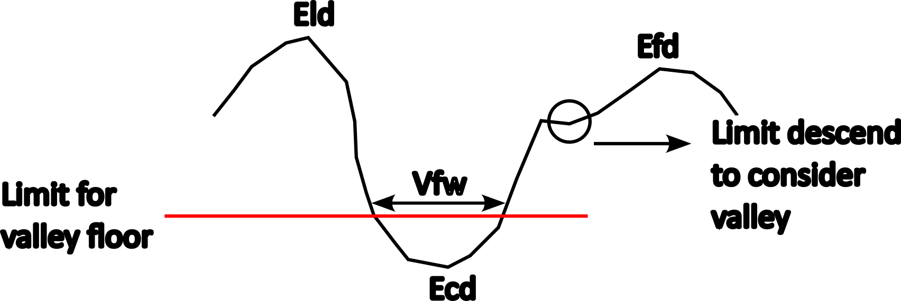

# Some explanations
Here I will give some explanitions of things that maybe aren't so obvious for who will use the plugin.

## Limit valley floor and minimum height valley
The "valley floor limit" is the height above the drainage channel below which the area is considered the "floor," while the "Limit descend to consider valley" represents the minimum relief drop required to determine the Eld or Efd (the algorithm selects the last point before the terrain "descends"—a minimum slope threshold is established so that minor dips are not mistaken for summits). Additionally, If (Eld - Ecd) or (Efd - Ecd) is less than minimum height for valley peak input, the valley is discarded.

## Transverse topographic symmetric factor and valley floor width to valley height ratio

For the TTSF, lines perpendicular to the midline are generated (spanning 10% to 90% of the midline length to minimize errors associated with the endpoints); the user defines the number of points where these perpendicular lines are created. If a perpendicular line fails to intersect the drainage line, it is discarded.  
A similar process applies to the valley floor-to-valley height calculation: a line perpendicular to the drainage line is generated (spanning 10% to 90% of the drainage length).

## Main channel or longest channel?

In my searchs, I encountered various morphometric indices calculated from the main channel (like sinuosity, TTSF, fitness, etc...) in one of two ways: either based on Strahler order or using the longest channel (Horton's classification of the main channel). Consequently, I included an option in the plugin's various tools to calculate metrics based on either the main channel or the longest channel.  
For instance, if the indices are being calculated for a single basin, using either the longest channel or the main channel works fine. However, if the indices are calculated for sub-basins (basins situated between other basins), it may be more appropriate to use the main channel for the calculation, given that it represents the continuation of the upstream channel.

## Midline
The midlines are constructed using the Voronoi polygonization method.